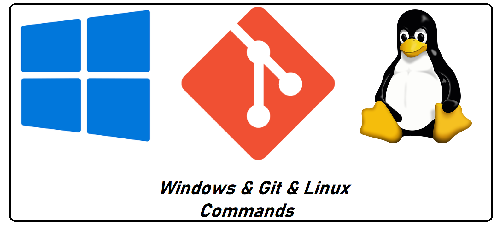
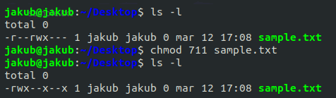
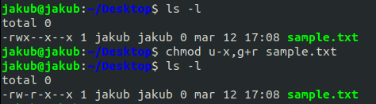

 

## Table of contents

- [Linux commands](#linux-commands)
  - [Managing files & directories](#managing-files--directories)
    - [Basic commands](#basic-commands)
    - [View / Edit file contents](#view--edit-file-contents)
    - [File summary](#file-summary)
    - [Archive & Compress & Extract files](#archive--compress--extract-files)
    - [Special file types (links)](#special-file-types-links)
    - [File permission](#file-permission)
  - [File system management](#file-system-management)
  - [Process management](#process-management)
  - [Managing users, groups and the system](#managing-users-groups-and-the-system)
  - [I/O commands](#io-commands)
  - [Network](#network)
  - [Hardware support](#hardware-support)
  - [Other](#other)
- [Windows commands](#windows-commands)
- [Git commands](#git-commands)
  - [User configuration](#user-configuration)
  - [Repository setup](#repository-setup)
  - [Inspect & Compare](#inspect--compare)
  - [Tracking path changes](#tracking-path-changes)
  - [Staging & Snapshot](#staging--snapshot)
  - [Branches & Merging](#branches--merging)
  - [Remote Repositories](#remote-repositories)
  - [Rewrite history](#rewrite-history)
  - [Temporary commits](#temporary-commits)

# Linux commands

This section gives insight into the most important commands of Linux system. Along with the individual commands, where appropriate, 
most popular parameters are listed and a typical sample application is introduced. To learn more about the various 
commands, it is usually possible to get additional information with the ***man*** program followed by the name of the command, 
for example,` man ls`.
## Managing files & directories
### Basic commands

- **`cd`**`examlpe` -- Change directory to *example*.
  - **`cd`**`..` -- move up one directory,
  - **`cd`**`../..` -- move up two directory,
  - **`cd`**`-` -- change to the previous directory,
  - **`cd`**`~` -- change to home directory.
  
- **`pwd`** -- Print the absolute path of current directory.

- **`ls`**`{OPTION}... {FILE}...` -- List directory contents.
  - Options (most popular):
    - *t* - sort the file by modification time,
    - *1* - display one file per line, 
    - *l* - display all information about files/directories,
    - *d* - list directories themselves, not their contents, 
    - *a* - do not ignore hidden files,
    - *i* - print the index number of each file,
    - *S* - sort by file size, largest first
    - *--group-directories-first* - group directories before files.

- **`cp`**`{OPTION}... {SOURCE}... {DIRECTORY}...`  -- Copy *source(s)* to *directory*.
  - Options (most popular):
    - *i* - ask for permission before user overwrite the destination file,
    - *r* - copy the entire directory structure,
    - *p* - preserves the time of the last data modification and the time of the last access, the ownership 
    and the file permission-bits of each source file in the corresponding destination
    file. 

- **`mv`**-- Move (rename) files and directories.
  - **`mv`**`{OPTION}... {SOURCE} {DEST}` - rename *source* to *dest*,
  - **`mv`**`{OPTION}... {SOURCE}... {DIRECTORY}` - move *source(s)* to *directory*.
  - Options (most popular):
    - *i* - prompt before overwriting an existing file,
    - *n* - never overwrite an existing file.

- **`mkdir`**`{OPTION}... {DIRECTORY}...` -- Create the *directory(ies)*, if the do not already exist.

- **`rmdir`**`{OPTION}... {DIRECTORY}...` -- Remove empty *directory(ies)*.

- **`rm`**`{OPTION}... {FILE}...` -- Remove *file* (by default it does not remove directories).
  - Options (most popular):
    - *f* - ignore non-existing files,  
    - *r* - remove directories and their contents,
    - *i* - prompt before every removal,
    - *v* - explain at all time what is being done.

- **`install`**` {OPTION}... {SOURCE}... {DIRECTORY}` -- Copy files (often just compiled) into destination locations.

### View / Edit file contents

- **`touch`**`{OPTION}... {FILE}...`  -- Change file timestamps or create empty file.

- **`cat`**`{OPTION}... {FILE}...` -- Reads data from the file and gives their content as output.
  - **`cat`**`>{FILE}` - create new file with content,
  - **`cat`**`>>{FILE}` - append content to the end of file_name,
  - **`cat`**`{FILE_1} >> {FILE_2}` - append the contents of file1 to the end of file2.
  - Options (most popular):
    - *n* - number all output lines,
    - *b* - number non-empty output lines,
    - *s* - suppress repeated empty output lines.

- **`tac`**`{OPTION}... {FILE}...` -- Write each *file* to standard output, last line first.

- **`nl`**`{OPTION}... {FILE}...` -- Write each *file* to standard output, with line numbers added.

- **`tail`**`{OPTION}... {FILE}...` -- Output the last part of files (by default it's 10 lines).
  - Options (most popular):
    - *n* nums - print the last nums lines, instead of the default 10,
    - *f* - output appended data as the file grows.

- **`head`**`{OPTION}... {FILE}...` -- Output the first part of files (by default it's 10 lines).
  - Options (most popular):
    - *n* nums - print the first nums lines, instead of the default 10.

- **`less`**`{FILE}...` -- Display *file* contents one page at the time.
  - Key commands (most popular):
    - space bar - move down one page,
    - b - move up one page,
    - g - go to the first line,  
    - /search_term - search forward from the current position for the search_term string,
    - ?search_term - search backward from the current position for the search_term string,
    - n - when searching, to to the next occurrence,
    - N - when searching, go to the previous occurrence.
- **`od`**`{OPTION}... {FILE}...` -- write an unambiguous representation, octal bytes by default, of 
*file* to standard output.

- **`base64`**`{OPTION}... {FILE}` -- Base64 encode or decode *file*, or standard input, to standard
output).
  - Options (most popular):
    - *d* - decode data
    - *i* - when decoding, ignore non-alphabet characters

- **`fold`**`{OPTION}... {FILE}...` -- Wrap each input line to fit in specified width.
  - Options (most popular):
    - *b* - limit the width of the output by the number of bytes (e.x. b40)

- **`gedit`**`{OPTION...} {FILE...}` -- Text editor for the GNOME Desktop.

- **`sort`**`{OPTION}... {FILE}...` -- Sort lines of text files (write sorted concatenation of all 
*file(s)* to standard output).
  - Options (most popular):
    - *r* - sort in reverse order
    - *n* - sort a file numerically
    - *u* - sort and remove duplicates

- **`test`**`{EXPRESSION}` -- Check file types and compare values (exit with the status determined by *expression*).

- **`expand`**`{OPTION}... {FILE}...` -- Convert tabs to spaces.

- **`unexpand`**`{OPTION}... {FILE}...` -- Convert spaces to tabs.

- **`fmt`**`{OPTION}... {FILE}...` --  Simple optimal text formatter (reformat each paragraph in the *file(s)*, writing to standard output).

- **`pr`**`{OPTION}... {FILE}...` -- Convert text files for printing.

- **`split`**`{OPTION}... {FILE[PREFIX]}` -- Split a file into pieces.

- **`csplit`**`{OPTION}... {FILE} {PATTERN}...` -- Split a file into sections determined by context lines.

- **`grep`**`{OPTION}... {PATTERN} {FILE...}` -- Print lines that match patterns.

- **`shuf`**`{OPTION}... {FILE}` --  Generate random permutations.

- **`uniq`**`{OPTION}... {INPUT {OUTPUT}}` -- Report or omit repeated lines (filter adjacent matching lines from *input*, writting to *output*.

- **`comm`**`{OPTION}... {FILE_1} {FILE_2}` -- Compare sorted files *file_1* and *file_2* line by line.

- **`tsort`**`{OPTION} {FILE}` -- Perform topological sort.

- **`cut`**`{OPTION}... {FILE}...` -- Remove sections from each line of files.

- **`paste`**`{OPTION}... {FILE}...` -- Merge lines of files.

- **`join`**`{OPTION}... {FILE_1} {FILE_2)` -- Join lines of two files on a common field.

### File summary

- **`wc`**`{OPTION}... {FILE}...` -- Show information about the file: number of lines, word count, byte and characters count. 

- **`sum`**`{OPTION}... {FILE}...` -- Checksum and count the blocks in a file.

- **`cksum`**`{FILE}...` -- Checksum and count the bytes in a file.

- **`md5sum`**`{OPTION}... {FILE}...` -- Compute and check MD5 message digest.

- **`sha1sum`**`{OPTION}... {FILE}` -- Compute and check SHA1 message digest.

### Archive & Compress & Extract files

Files that have a **.tar.gz** or a **.tar.bz2** extension are compressed archive files. A file with just a **.tar** extension is 
is a single, uncompressed file, that stores many files. The **.gz** or **.bz2** extension suffix indicates that the archive has been compressed, using
either the gzip or bzip2 compression algorithm. 

- **`tar`**`{OPTION}... {ARCHIVE_FILE} {FILE_OR_DIRECTORY_TO_BE_ARCHIVED}` -- Create Archive and extract the Archive files.
  - Options (most popular):
    - *c -* create archive,
    - *x -* extract archive,
    - *f -* creates archive with given filename,
    - *t -* displays or lists files in archived file,
    - *u -* archives and adds to an existing archive file,
    - *v -* display verbose information, 
    - *A -* concatenates the archive files,
    - *z -* zip, tells tar command that create tar file using gzip,
    - *j -* filer archive tar file using tbzip,
    - *W -* verify a archive file,
    - *r -* update or add file or directory in already existed .tar file
    
  **Examples**:
    - **Create tar archive file with `-cvf` option:**
    ```
    $ tar -cvf this_is_new_archive.tar ~/Desktop/Python_Examples/
    ```
    *Above command will create a tar archive file called **this_is_new_archive.ta**r for **Python_Examples** directory 
    in current working directory.*
    
    ---
    
    - **Create tar.gz archive file with `-cvzf` option:**
    ```
    $ tar cvzf images_italy_2020.tar.gz /home/user/italy_2020/
    ```
    *Above command will create compressed **image_italy_2020.tar.gz** file for **italy_2020** directory in current 
    working directory.*
    
    ---
    
    - **Create tar.bz2 archive file with `-cvfj` option:**
    ```
    $ tar cvfj images_oslo_2020.tar.bz2 /home/user/oslo_2020/
    ```
    *Above command will create compressed **image_oslo_2020.tar.bz2** file for **oslo_2020** directory in current 
    working directory.*
    
    ---
    
    - **Extract or uncompress file with `-xvf` option:**
    ```
    $ tar -xvf this_is_archived_file.tar
    or
    $ tar -xvf this_is_archived_file.tar -C ~/Desktop/tmp/
    ```
    *Above command will untar **this_is_archived_file.tar** file in current working directory. We can use *`-C`* option to
    untar in a different directory, e.x. **~/Desktop/tmp/**. With `-xvf` option we can also extract .tar.gz or .tar.bz2 file.*
    
    ---
    
    - **List content of an archive file with `-tvf` option:**
    ```
    $ tar -tvf archive_file.tar.bz2
    ```
    
    ---
    
    - **Extract a single file from an archive tar file with `-xvf` option:**
    ```
    $ tar -xvf from_where.tar fiele_name.pdf
    ```
    *Above command will extract **file_name.pdf** from **from_where.tar**. To extract a file from **.tar.gz** use *`-zxvf`* option 
    and from file **.tar.bz2** use *`-jxvf`* option.*
    
    ---
    
    - **Add files and directories to tar archive file with *`-rvf`* option:**
    ```
    $ tar -rvf photos_france.tar paris.jpg
    ```
    *Above command will append **paris.jpg** file to an archive tar file called **photos_france.tar**. The command tar does not
    support appending files to compressed tar.gz or tar.bz2 files.*
    
### Special file types (links)

A **hard link** is a direct link to the data on disk. This means data can be accessed directly via an original filename or a 
hard link. Both the original file and the hard link are direct links to the data on disk. The use of a hard link allows 
multiple filenames to be associated with the same data on disk.

A **symbolic link** (also sometimes known as a soft link) does not link directly to the data on disk but to another link to the 
data on disk. On most operating systems folders may only be linked using a symbolic link.

- **`ln`**`{OPTION}... {TARGET} {FILE}` -- Make links between files (if the -s option is not specified, it will create 
hard link).
  - Options (most popular):
    - *s -* create symbolic link instead of hard link.
- **`readlink`**`{OPTIONS}... {FILE}...` -- Print resolved symbolic links or canonical file names.
- **`unlink`**`{FILE}` -- Remove the specified file.

### File permission

Every file and directory on Linux system is assigned 3 types of owner, given below:
- **User** - Who is the owner of a file. By default, the person who created a file becomes its
owner.
- **Group** - Can contain multiple users. All users belonging to a group will have the same 
access permissions to the file. Suppose you have a project where a number of people require 
access to a file. Instead of manually assigning permissions to each user, you could add all 
users to a group, and assign group permission to file such that only this group members and
no one else can read or modify the files.
- **Others** - Any other user who has access to a file. This person has neither created the
file, nor he belongs to a user group who could own the file. Practically, it means everybody
else. 

In Linux, every file and directory has it's own three permissions defined for all the 3 owners
discussed above:

- **Read** - This permission allows you to open and read a file.
- **Write** - The write permission gives you the authority to modify the contents of a file. 
The write permission on a directory gives you the authority to add, remove and rename files 
stored in the directory.
- **Execute** - In Linux, you cannot run a program unless the execute permission is
set. If the execute permission is not set, you might still be able to see/modify the program
code(provided read & write permissions are set), but not run it.

On the picture below we can see that the owner of the *random_file.txt* has `rw-` permission, the group
and the others have `r--` permission. The first sign of permission stands for type of the file.


The most popular command that enable us to change the file permission (read, write, execute) 
for the owner, group and the world has the syntax as follow:
- **`chmod`**`{PERMISSION} {FILE}...` -- Change file permission.

The table below gives all possible combinations of a file *permission* that each file can have:

| Number        | Symbol          | Permission              |        
| :------------:|:---------------:|:------------------------|
| 0             | ---             | No permission           |
| 1             | --x             | Execute                 |
| 2             | -w-             | Write                   |
| 3             | -wx             | Write + Execute         |
| 4             | r--             | Read                    |
| 5             | r-x             | Read + Execute          |
| 6             | rw-             | Read + Write            |
| 7             | rwx             | Read + Write + Execute  |

There are 2 ways to use **`chmod`** command:

- By specifying permission as a **three-digit octal number** (you change permission for all 3 owners).


- By specifying permission as **symbolic mode** (so that you can modify permission of a specific group).


The table below contains all symbols you will need in order to use symbolic mode:

| Symbol        | Meaning                                                  |       
| :------------:|:--------------------------------------------------------:|
| +             | Add a permission to a file or directory                  |
| -             | Remove the permission                                    |
| =             | Set a permission and overwrite the permission set earlier|
| u             | User/owner                                               |
| g             | Group                                                    |
| o             | Others                                                   |
| a             | All                                                      |


In order to change file ownership or group, the following commands are used:
- **`chown`**`{OPTIONS}... {OWNER{:GROUP}} {FILE}...` -- Change file owner and group.
- **`chgrp`**`{OPTIONS}... {GROUP} {FILE}...` -- Change group ownership.


## File system management

- **`df`**`{OPTION}... {FILE}...` -- Display information related to file systems 
about total space and available space. If no file name is given, it displays the 
space available on all currently mounted file systems.
- **`du`**`{OPTION}... {FILE}...` -- Summarize disk usage of the set of files, 
recursively for directories.
  - Options (most popular):
    - *c* - produce a grand total,
    - *h* - print size in human readable format,
    - *d* - display only a total size for each argument.
- **`stat`**`{OPTION}... {FILE}...` -- Display file or file system status.
- **`truncate`**`{OPTION}... {FILE}...` --  Shrink or extend the size of a file to the 
specified size.

## Process management
**`env`**` {OPTION}... {-} {NAME=VALUE}... {COMMAND {ARG}...}` -- Run a program in a modified 
environment. Executing env with no options displays the current environment variables and their values.

**`kill`**`{OPTION}... <PID>` -- Send a signal to a process.

**`ps`**`{OPTION}`... -- Report a snapshot of he current processes.

**`top`** -- Display Linux processes.

**`watch`**`{OPTIONS}... {COMMAND}` -- Execute a program periodically, showing output fullscreen.
By default, command is run every 2 seconds and watch will run until interrupted.
  - Options (most popular):
    - *d* - highlight the differences between successive updates,
    - *n* - specify update interval
 
 **`systemctl halt`** -- Halt the system.
 
 **`systemctl poweroff`** -- Power off the system.

**`systemctl reboot`** -- Restart the system.

**` systemctl suspend`** -- Suspend the system.

**`systemctl hibernate`** -- Hibernate the system.
 
## Managing users, groups and the system

**`apt-get`**`{OPTIONS}... {COMMAND}` -- is a command-line tool which helps in handling packages in Linux. 
Its main task is to retrieve the information and packages from the authenticated
sources for installation, upgrade and removal of packages along with their
dependencies. Here APT stands for the ***Advanced Packaging Tool***. 

  - Commands (most popular):
    - *`update`* - synchronize the package index files from their sources again. `apt-get` basically works on a database of available packages. 
    If you don’t update this database, the system won’t know if there are newer packages available or not. 
    - *`upgrade`* -  install the latest versions of the packages currently installed 
    on the user’s system from the sources enumerated in */etc/apt/sources.list*. The 
    installed packages which have new packages available are retrieved and installed.
    You need to perform an update before the upgrade, so that `apt-get` knows that new
    versions of packages are available.
    - *`install`* - this command is used to install or upgrade packages. It is 
    followed by one or more package names the user wishes to install. All the 
    dependencies of the desired packages will also be retrieved and installed. 
    The user can also select the desired version by following the package name 
    with an ‘equals’ and the desired version number.
    - *`remove`* -  removes the packages (it does not remove any configuration 
    files created by the package).
    - *`purge`* - removes the packages, and also removes any configuration files 
    related to the packages.
    - *`clean`* - clean the local repository of retrieved package files.
    - *`autoremove`* - removes libraries and packages that were installed 
    automatically to satisfy the dependencies of another installed package. 
    If that package is removed, these automatically installed packages are 
    useless in the system.
    
**`passwd`**`{OPTIONS}... {LOGIN}` -- Change user password.
  - Options (most popular):
    - *d* - delete a user's password (it will set the named account passwordless),
    - *e* - immediately expire an account's password (force a user to change his/her password at the user's next login),
    - *x* - set the maximum number of days a password remains valid (after *MAX_DAYS*, the password is required to be changed),
    - *w* - set the number of days of warning before a password change is required.
    
**`su`**`{OPTION}... {USERNAME}` -- Change user ID or become superuser.
 
**`sudo`** -- Execute a command as another user.
 
**`who`**`{OPTIONS}...` -- Print information about users who are currently logged in.
 
**`w`**`{OPTIONS}...` -- Displays information about the users currently on the machine, and 
their processes.  The header shows, in this order, the current time, how long the 
system has been running, how many users are currently logged on, and the system
load averages for the past 1, 5, and 15 minutes.
  - Options (most popular):
    - *s* - use the short format, don't print the login time, JCPU or PCPU times.
    - *user* - show information about the specified user only.
    - *i* - display IP address instead of hostname for *from* field.
    
**`whoami`**`{OPTION}...` - Print the user name associated with the current effective user ID.
 
**`groups`**`{OPTION}... {USERNAME}...` -- Print group memberships for each USERNAME or, if no USERNAME is specified, 
for the current process.
 
**`groupadd`**`{OPTIONS}... {GROUP}` -- Create a new group.
 
**`groupmod`**`{OPTIONS}... {GROUP}` -- Modify a group definition on the system. 

**`groupdel`**`{OPTIONS}... {GROUP}` -- Delete a group.
 
**`users`**`{OPTIONS}...` -- Print the user names of users currently logged in the
current host. 
 
**`useradd`**`{OPTIONS}... {LOGIN}` -- Create a new user or update default new user information. 
 
**`usermod`**`{OPTIONS}... {LOGIN}` -- Modify a user account.
 
**`userdel`**`{OPTIONS}... {LOGIN}` -- Delete a user account and related files.
 
**`logname`**`{OPTION}...` -- Print user's login name.
 
**`id`**`{OPTION}... {USER}` -- Print user and group information for the specified *user*,
or (when *user* omitted) for the current user.
 
**`arch`**`{OPTION}...` -- Print machine architecture.
 
**`date`**`{OPTIONS}...` -- Print or set the system date and time.
 
**`uname`**`{OPTION}...` -- Print system information.
  - Options (most popular):
    - *a* - print all available information.
    - *r* - print the kernel release.
    - *v* - print the kernel version.
    
**`hostname`**`{OPTIONS}...` -- Show or set the system's host name.
 
**`hostid`**`{OPTIONS}...` -- Print the numeric identifier fot the current host.
 
**`uptime`**`{OPTIONS}...` -- Print how long the system has benn running. 
 
**`lsmod`** -- Show the status of modules in the Linux Kernel.
 
**`tty`**`{OPTION}...` -- Print the file name of the terminal connected to standard input.

## I/O commands

**`echo`**`{OPTION}... {STRING}...` -- Display a line of text.

**`yes`**`{STRING}`... -- Output a string repeatedly until killed.

**`read`** -- Read from a file descriptor. 

**`tee`**`{Option}... {FILE}...` -- Read from standard input and write to standard output and files.

## Network

**`iwconfig`** -- Configure a wireless network interface.

**`iwgetid`** -- Report ESSID, NWID or AP/Cell Address of wireless network.

**`iwlist`** -- Get more detailed wireless information from a wireless interface.

**`wget`**`{OPTION... {URL}...` -- The non-interactive network downloader.

## Hardware support

**`lspci`**`{OPTION}...` -- List all PCI devices.

**`lsusb`**`{OPTION}...`-- List USB devices.

**`lscpu`**`{OPTION}...` -- Display information about the CPU architecture.

**`lshw`**`{OPTION}...` -- Small toll to extract detailed information on the hardware configuration of the machine.

## Other

**`clear`** -- Clear the terminal screen.

**`man`** -- An interface to the on-line reference manuals.

**`sleep`**`{NUMBER}` -- Delay for a specified amount of time.

**`factor`**`{NUMBER}` -- Factor numbers.

**`seq`**`{OPTION}... {FIRST} {INCRMENT} {LAST}` -- Print a sequence of numbers.

___

# Windows commands

___

# Git commands

## User configuration

- **`git config`**`--global user.name '{firstname lastname}'` -- Set a name for identification.

- **`git config`**`--global user.email '{email}'` -- Set associated email address.

## Repository setup

- **`git init`** - Initialize an existing directory as a Git repository.

- **`git clone`**`{url}` - Retrieve an entire repository from a hosted location via URL.

## Inspect & Compare

- **`git log`** -- Show the commit history for the currently active branch.

- **`git log`**`branchB..branchA` -- Show the commits on **branchA** that are not on **branchB**.

- **`git log`**`--follow {file}` -- Show the commits that changed file.

- **`git diff`**`branchB..branchA` -- Show difference of what is in **branchA** that is not in **branchB**.

## Tracking path changes

- **`git rm`**`{file}` - Delete the file from project and stage the removal for commit.

- **`git mv`**`{existing_path} {new_path}` - Change an existing file path and stage the move.

## Staging & Snapshot

- **`git status`** -- Show modified files in working directory, staged for next commit.

- **`git add`**`{file}` -- Add a file as it looks now to staging area for your next commit. Use `git add .` to add all files.

- **`git reset`**`{file}` -- Unstage a file while retaining changes in working directory.

- **`git diff`** -- Difference of what is changed but not staged.

- **`git diff`**`--staged` -- Difference of what is staged but not yet committed.

- **`git commit`**`-m {commit_message}` -- Commit your staged content as a new commit snapshot.

- **`git revert`**`{commit}` -- Create new commit that undoes all of the changes made in `{commit}`, then
  apply it to the current branch.

- **`git clean`**`-n` -- Shows which untracked files would be removed from working directory.
  Replace the `-f` flag with the `-n` flag to execute the clean.

## Branches & Merging

- **`git branch`** -- List your branches. 

- **`git branch`**`{branch_name}` -- Create a new branch at the current commit.

- **`git checkout`**`{branch_name}` -- Switch to another branch and check it out into your working directory.
  Use `-b` flag to create and check out a new branch.

- **`git branch`**`-d {branch_name}` -- Delete a branch.

- **`git merge`**`{branch_name}` -- Merge the specified branch's history into the current one.

## Remote Repositories

- **`git remote add`**`{remote_alias} {url}` -- Connect your local repository to a remote repository.

- **`git fetch`**`{remote_alias}` -- Fetch down all the branches from that Git remote.

- **`git merge`**`{remote_alias}/{branch_name}` -- Merge a remote branch into your current branch to bring it up to date.

- **`git push`** -- Transmit local branch commits to the remote repository branch.

- **`git push`**`-u {remote_alias} {branch_name}` -- Transmit local, non-master branch commits to the remote repository as a
  new branch. `-u` stands for `--set-upstream`. You can also use `origin` instead of `{remote_alias}`.

- **`git push`**`--force` -- Overwrite remote repository with local working directory.

- **`git pull`** -- Fetch and merge any commits from the tracking remote branch.

## Rewrite history

- **`git commit`**`--amend` -- Replace the last commit with staged changes and last commit combined. Use with
  nothing staged to edit commit's message.

- **`git rebase`**`{branch_name}` -- Apply any commits of current branch ahead of specified one.

- **`git reset`**`--hard {commit}` -- Clear staging area, rewrite working tree from specified commit. Most often
  used with `HEAD`, which points on the latest commit.

- **`git rm`**`--cached {file}` -- Stop tracking specified file.

- **`git reflog`** -- Show a log of changes to the local repository's HEAD. Add `--all` to show all refs.

## Temporary commits

- **`git stash`** -- Save modified and staged changes.

- **`git stash list`** -- List stack-order of stashed file changes.

- **`git stash pop`** -- Write working from top of stash stack.

- **`git stash drop`** -- Discard the changes from top of stash stack.


